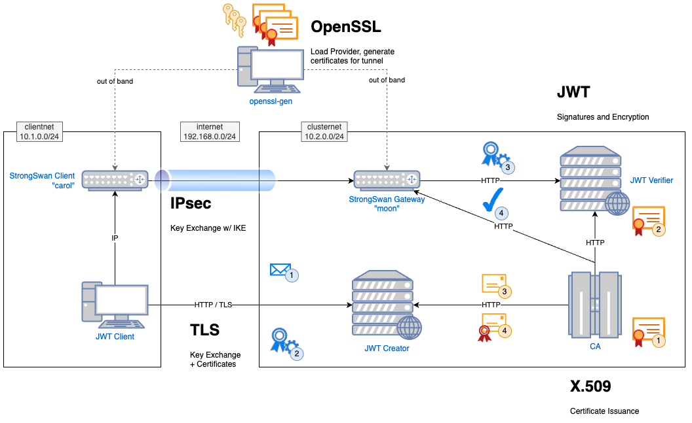
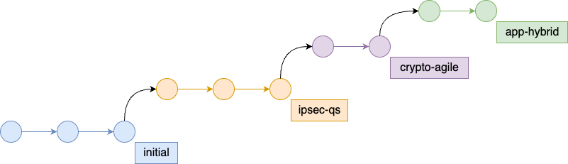

# prototype-quantum-safe

**The Migros Quantum-Safe Prototype**

## Description

As part of Migros' security strategy, our teams are exploring options to integrate Quantum-Safety into our digital products.  
In an early step, Migros has decided to explore the possibilities for hardening a microservices-based infrastructure involving multiple interesting protocols against attackers with access to large (so-called "cryptanalytically relevant") quantum computers.  
To promote collaboration on this upcoming migration across enterprises, and with the public cyber security community, Migros has decided to open-source its prototype.

This project implements such a prototype system and transforms it into a quantum-safe state.

> [!IMPORTANT]
> This project is meant solely as an experiment.
> It published to prove the feasibility of a (partial) transition to post-quantum cryptography.  
> This project's code is NOT production-ready and should not be used in adversarial settings.

The project contains multiple branches, each meant to snapshot a specific points during the migration, in order to illustrate the different states of the transformation.
An analysis tool, which empirically compares the performance characteristics of these snapshots, is available at <https://github.com/migros/migros-quantum-safe-analysis>.  
Analysis results for the latest state of this repository are also available there.

This repository is *not* being actively maintained. Updates to external repositories, e.g. the removal of old versions, may lead to failing builds of the docker containers.  

The included crypto-agility library is **neither secure nor production-ready** and we discourage anyone from using it for purposes other than prototyping!  
It's sole purpose is to illustrate the approach of centralizing cryptographic functions.

## Prototype Architecture

The diagram below illustrates the different networks and components. A microservice cluster exposes a web application ("JWT Creator") to the "internet" which allows signing messages as JWTs.

Via an IPsec tunnel, the client can also reach a "JWT Verifier" which will examine the received JWT and verify it against an internal CA; as well as the internal CA which constitutes the root of trust for the TLS connection.

The orange icons represent the setup phase: An OpenSSL container sets up certificates and keys for the IPsec tunnel, the CA generates its own certificate (1), distributes it (2) and responds to CSRs from "JWT Creator" (3) with signed server certificates (4).

Upon an interaction request by the user, the client contacts in turn: JWT Creator with a message (1) - which is then packaged into a JWT and returned (2) - and JWT Verifier with the JWT (3) to receive a confirmation message (4).



We employed the following software in one or more parts of this prototype:
| Component                                                                                     | Version               | Found in                                  |
| --------------------------------------------------------------------------------------------- | --------------------- | ----------------------------------------- |
| Java 17                                                                                       | openjdk 17.0.2        | JWT Creator, JWT Verifier, JWT Client, CA |
| Bouncy Castle:<br>  bcprov-jdk18on<br>  bcutil-jdk18on<br>  bcpkix-jdk18on<br>  bctls-jdk18on | org.bouncycastle 1.74 | JWT Creator, JWT Verifier, JWT Client, CA |
| Json Library                                                                                  | org.json              | 20230618                                  | JWT Creator, JWT Verifier |
| Strongswan                                                                                    | strongswan 6.0.0beta5 | StrongSwan Gateways                       |
| liboqs                                                                                        | 0.8.0                 | StrongSwan Gateways, "openssl-gen"        |
| openssl                                                                                       | 3.0.11+               | "openssl-gen"                             |
| oqs-provider                                                                                  | 0.5.1                 | "openssl-gen"                             |

## Outcome

**Definition**: We speak of "hybrid" signatures or key exchanges when both a classical AND a quantum-safe algorithm are involved in the protocol and both must succeed for further operation.  
This has the advantage that classical security cannot degrade during migration, as the classical algorithm is still involved.

We quickly summarize the final state of the prototype here and refer to further documentation for the details:

* [IPsec](docs/RESULTS_IPsec.md) (secure if algorithms are):
  * Certificates are quantum-safe but not hybrid
    * Quantum-Safe algorithm could have classically exploitable flaw
  * Key exchange is hybrid (X25519 + Kyber)
    * Confidentiality of data is preserved
* [TLS](docs/RESULTS_TLS.md) (preparation):
  * Certificates are hybrid & backwards-compatible but verification is only classical
    * Quantum-Attackers could impersonate servers by omitting quantum-safe extension
  * Key exchange and certificate verification is classical
    * Harvest-now-decrypt-later remains possible until client upgrades to quantum-safe TLS
* [Application-Layer / JWT](docs/RESULTS_JWT.md) (best case):
  * Certificates are hybrid but not backwards-compatible
    * Secure against Quantum-Attackers
  * JWT signing and verification is hybrid
    * Secure against Quantum-Attackers

In total, this partial migration of the code-base took roughly 6 person-days for the crypto-agility features and 4 person-days to change the algorithms.  
This includes exploration and failed attempts as well as engineering a suitable solution for each use case.

## Snapshots Overview



The repository contains 4 branches representing the snapshots:

* initial: a reasonable starting point for an existing system
  * fully classical
  * not crypto-agile
* ipsec-qs: the IPsec tunnel uses hybrid key exchange and quantum-safe certificates
  * leveraging oqs-provider and StrongSwan's integration of liboqs
* crypto-agile: no changes to used algorithms but a new library is created to centralize cryptographic functions
  * custom-made to fit the application's use-cases
* app-hybrid: final changes to support quantum-safe algorithms and hybrid certificates
  * small configuration changes finished the migration

If quality-of-life updates are made to the code, they should be replicated to the appropriate source branch and the later ones rebased. Failing that, the updates should be duplicated on all branches.  
The analysis software will fetch the snapshots as the latest commits on each branch.

## Installation

We provide a containerized setup. To run it, only Java with Maven, Docker & Docker Compose should be needed.
See [Docker Desktop](https://docs.docker.com/desktop/) for installation instructions.

## Usage

The following steps are also implemented as a VScode build task:

* Run `mvn -B package  -DskipTests` to create the jar files
* `docker compose up` starts containers. If everything goes well, your console should show:

```plain
jwt-client    | I am a JWT Client!
jwt-client    | I have the CA certificate
jwt-client    | I am ready to interact with the system at jwt-client:80/interact/
```

* You can then interact with them by visiting <http://localhost:8080/interact/>

## Support

Please contact [marc.himmelberger@mgb.ch](mailto:marc.himmelberger@mgb.ch) for issues relating to this repository. You are also welcome to open Issues and Pull Requests directly.  
For general questions about quantum-safety at Migros, please use [security-architecture@mgb.ch](mailto:security-architecture@mgb.ch).  
For press inquiries, please  contact [media@migros.ch](mailto:media@migros.ch).

## License

This project is provided under the [Apache License 2.0](LICENSE.txt).  
We encourage feedback and open discussion on this GitHub page.
